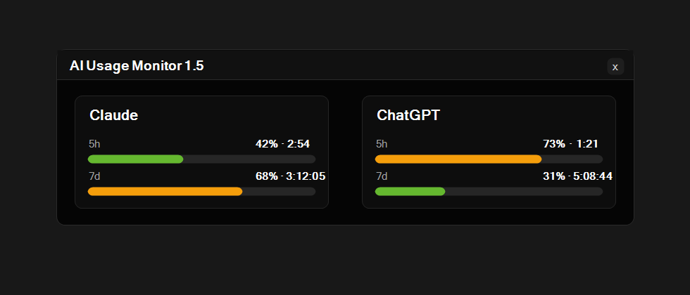

[](https://opensource.org/licenses/MIT)

# AI Usage Monitor



AI Usage Monitor is a lightweight Windows floating desktop widget for people using Claude and/or ChatGPT from the command line.

It shows how much of your current usage windows remains without opening a terminal or provider website.

## What You Get

- Claude and ChatGPT usage shown as equal first-class services
- A **5h** usage bar for the current short window
- A **7d** usage bar for the current weekly window
- Remaining time shown as `hours:minutes` for 5h and `days:hours:minutes` for 7d
- Side-by-side or stacked layout
- A small floating desktop window with optional Always on Top mode
- A single generic tray icon
- Double-click the tray icon to show or hide the window
- Right-click options for refresh, displayed services, layout, update frequency, language, startup, updates, and exit

## Requirements

- Windows 10 or Windows 11
- Claude Code installed and authenticated if you want Claude usage
- Codex CLI installed and authenticated if you want ChatGPT usage

If you use Claude Code through WSL, that is supported too. The monitor can read Claude Code credentials from Windows or from your WSL environment.

## Install

Download the latest `ai-usage-monitor.exe` from the [Releases](https://github.com/jpribil/AI-Usage-Monitor/releases) page and run it directly.

## Use

Run:

```powershell
ai-usage-monitor
```

Once running, it appears as a floating desktop window and as a tray icon in the notification area.

- Drag the window to move it around the desktop
- Use `Layout` to switch between side-by-side and stacked services
- Enable `Always on Top` from the Settings menu if you want it above other windows
- Double-click the tray icon to show or hide the window
- Enable `Start with Windows` if you want it to launch automatically when you sign in

### Services

Use the right-click **Services** menu to choose what the window displays:

- **Claude Code** reads local Claude credentials and Claude usage windows
- **ChatGPT** reads local Codex credentials and ChatGPT/Codex usage windows

You can show either service on its own or both together.

### System Tray Icon

The app shows one generic tray icon. Double-click it to show or hide the floating window, or right-click it for the app menu.

## Diagnostics

If you need to troubleshoot startup or visibility issues, run:

```powershell
ai-usage-monitor --diagnose
```

This writes a log file to:

```text
%TEMP%\ai-usage-monitor.log
```

Settings are saved to:

```text
%APPDATA%\AIUsageMonitor\settings.json
```

## Account Support

Claude support follows the account types supported by Claude Code.

As of **March 19, 2026**, Anthropic's Claude Code setup documentation says:

- **Supported:** Pro, Max, Teams, Enterprise, and Console accounts
- **Not supported:** the free Claude.ai plan

ChatGPT support follows the local Codex CLI authentication available on your machine.

## Privacy And Security

This project is open source, so you can inspect exactly what it does.

What the app reads:

- Your local Claude Code OAuth credentials from `~/.claude/.credentials.json`
- If needed, the same credentials file inside an installed WSL distro
- Your local Codex credentials from `$CODEX_HOME/auth.json` or `~/.codex/auth.json`

What the app sends over the network:

- Requests to Anthropic's Claude endpoints to read Claude usage and rate-limit information
- Requests to ChatGPT's Codex usage endpoint to read ChatGPT usage and rate-limit information
- Requests to GitHub only if you use the app's update check / self-update feature
- If proxy environment variables such as `HTTPS_PROXY`, `HTTP_PROXY`, or `ALL_PROXY` are set, those outbound requests may use that proxy

What the app stores locally:

- Window position
- Polling frequency
- Language preference
- Last update check time
- Displayed service preferences
- Layout preference

What it does **not** do:

- It does not send your credentials to any other server
- It does not use a separate backend service
- It does not collect analytics or telemetry
- It does not upload your project files
- It does not directly edit your Codex credentials file

Notes:

- If your Claude Code token is expired, the app may ask the local Claude CLI to refresh it in the background
- If your Codex token is expired, the app may ask the local Codex CLI to refresh it in the background. The monitor does not write `auth.json` itself; any credential update is handled by the Codex CLI.
- Portable installs can update themselves by downloading the latest release from this repository
- Proxies should be trusted because proxied usage requests include your OAuth bearer token inside the TLS connection

## How It Works

The monitor:

1. Finds enabled service login credentials
2. Reads current usage from Anthropic and/or ChatGPT
3. Shows the result in a floating Windows desktop window
4. Refreshes periodically in the background

If the newer Claude usage endpoint is unavailable, it can fall back to reading the rate-limit headers returned by Claude's Messages API.

## Open Source

This project is licensed under MIT.
